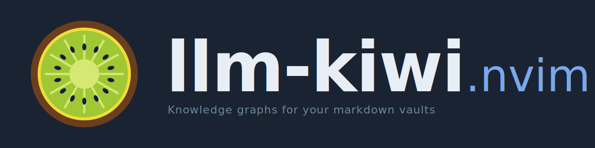

<p align="center">
  
</p>

<p align="center">
  <a href="https://github.com/Narong-Kanthanu/llm-kiwi.nvim/actions/workflows/ci.yml"></a>
  <a href="./LICENSE"></a>
  <a href="https://neovim.io"></a>
  <a href="./CODE_OF_CONDUCT.md"></a>
</p>

# llm-kiwi.nvim

An interactive knowledge-graph viewer for Neovim — scans `[[wikilinks]]`
across one or more markdown vaults and opens a force-directed graph in your
browser. Click (or `hjkl`-navigate) a node to jump straight into that `.md`
file inside the running Neovim instance.

<!-- Demo: add a GIF or screenshot at docs/demo.png and uncomment -->
<!--  -->


Built for browsing **AI-generated wikis** in the style of Andrej Karpathy's
[llm-wiki concept](https://gist.github.com/karpathy/442a6bf555914893e9891c11519de94f)
— incrementally-maintained markdown networks synthesized by an LLM — but
works with any Obsidian-flavoured vault or plain `[[wikilink]]` notes.

## Features

- Force-directed graph of notes and wikilink edges (vis.js, rendered in your
  browser)
- Vim-style keyboard navigation: `hjkl` to move, `Enter` to focus,
  `f` to search, `w` to switch workspace, `o` to open in Neovim, `Esc` to back
- Mouse support: drag to pan, scroll to zoom, hover to highlight, click to
  focus, double-click / label-click to open the note
- Multi-vault support with an in-browser workspace selector
- Opens files back in your running Neovim via its RPC socket
- Unresolved `[[links]]` shown as ghost nodes

## Requirements

- Neovim 0.9+
- Python 3.10+ on `PATH`
- macOS for in-place browser tab refresh (AppleScript). On other platforms,
  each invocation opens a new browser tab via `webbrowser.open`.

## Install

With [lazy.nvim](https://github.com/folke/lazy.nvim):

```lua
{
  "Narong-Kanthanu/llm-kiwi.nvim",
  cmd = { "LlmKiwiOpen", "LlmKiwiClose", "LlmKiwiList" },
  opts = {
    workspaces = {
      { name = "personal", path = "~/notes" },
      { name = "llm-wiki", path = "~/llm-wiki" },
    },
  },
  keys = {
    { "<leader>kg", "<cmd>LlmKiwiOpen<cr>", desc = "LLM Kiwi: open graph" },
  },
}
```

No keymaps are registered by default — bind what you want.

## Commands

| Command                      | Description                               |
| ---------------------------- | ----------------------------------------- |
| `:LlmKiwiOpen [workspace]`   | Open graph; optionally activate workspace |
| `:LlmKiwiClose`              | Stop the running graph server             |
| `:LlmKiwiList`               | List configured workspaces                |
| `:checkhealth llm-kiwi`      | Verify python, script, and vault paths    |

## Configuration

All options with their defaults:

```lua
require("llm-kiwi").setup({
  workspaces = {},          -- { { name = "...", path = "..." }, ... }
  python = "python3",       -- python executable
  script = nil,             -- path to vault-graph.py (auto-resolved)
  port = 18765,             -- local HTTP port for the graph server
  open_browser = true,      -- set false to just generate HTML
  output = nil,             -- if set, write static HTML here instead of running server
  nvim_server = true,       -- pass vim.v.servername so clicks open in this nvim
})
```

## Using with obsidian.nvim

If you already configure vaults via
[obsidian.nvim](https://github.com/obsidian-nvim/obsidian.nvim), reuse them:

```lua
{
  "Narong-Kanthanu/llm-kiwi.nvim",
  cmd = { "LlmKiwiOpen", "LlmKiwiClose", "LlmKiwiList" },
  config = function()
    require("llm-kiwi").setup({
      workspaces = {
        { name = "personal", path = os.getenv("PERSONAL_VAULT_PATH") },
        { name = "work",     path = os.getenv("WORK_VAULT_PATH") },
      },
    })
  end,
  keys = {
    {
      "<leader>kg",
      function()
        local ws = Obsidian and Obsidian.workspace and Obsidian.workspace.name
        require("llm-kiwi").open({ workspace = ws })
      end,
      desc = "LLM Kiwi: open graph",
    },
  },
}
```

## Credits

- Graph concept inspired by Andrej Karpathy's
  [llm-wiki gist](https://gist.github.com/karpathy/442a6bf555914893e9891c11519de94f).
- Graph rendering by [vis.js](https://visjs.org/) (loaded from jsDelivr CDN).

## Contributing

Contributions are welcome — please read
[CONTRIBUTING.md](./CONTRIBUTING.md) first. By participating, you agree to
abide by the [Code of Conduct](./CODE_OF_CONDUCT.md). For security
reports, see [SECURITY.md](./SECURITY.md). A summary of user-facing
changes lives in the [Changelog](./CHANGELOG.md).

## License

[MIT](./LICENSE)
